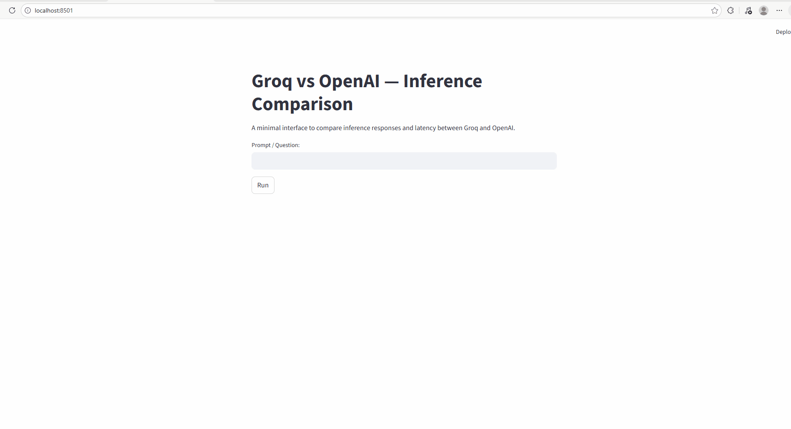

# Groq vs OpenAI — Inference Comparison


This small demo compares inference responses and latency between Groq and OpenAI. It provides a minimal Streamlit UI (and a CLI fallback) to submit a single prompt and view each provider's response and timing.

## Example outcome
Below is an example run showing the app header, prompt box, responses and latency comparison.



If the screenshot file is not present, the repository includes an SVG illustration at `images/outcome.svg` as a fallback.

## Files
- `app.py` — Streamlit app / CLI fallback. Clean, prompt-only UI titled "Groq vs OpenAI — Inference Comparison".
- `groq_client.py` — Groq client wrapper. Dynamically imports the `groq` SDK, reads `GROQ_API_KEY` and `GROQ_MODEL`, supports optional fallback via `AUTO_GROQ_FALLBACK`, and handles model-not-found errors gracefully.
- `OpenAI_Copilot_baseline.py` — OpenAI wrapper. Dynamically imports `openai`, reads `OPENAI_API_KEY`, and returns friendly messages when the client or key is missing.
- `Groq_Client_super fast).py` — deprecated stub left in the repo. Prefer `groq_client.py`.
- `requirements.txt` — candidate packages used by the project.

## How it works
- The UI accepts a single prompt. No context field is shown (the app always passes an empty context to inference calls).
- On submit, the app calls `groq_answer()` and `openai_answer()` and displays both responses and their latencies.
- If `streamlit` is not installed, a CLI fallback prompts for a single prompt and prints results.

## Environment variables
- `OPENAI_API_KEY` — required for OpenAI calls (or OpenAI wrapper will return a friendly message).
- `GROQ_API_KEY` — required for Groq calls.
- `GROQ_MODEL` — (recommended) model name to use for Groq (e.g. `mixtral-8x7b`). If not set, the client will refuse to attempt defaults unless `AUTO_GROQ_FALLBACK` is enabled.
- `AUTO_GROQ_FALLBACK` — set to `1` or `true` to allow `groq_client.py` to attempt a short list of default models (useful for testing but may hit inaccessible models and produce 404 errors).

Example (PowerShell):
```
$env:OPENAI_API_KEY="your_openai_key"
$env:GROQ_API_KEY="your_groq_key"
$env:GROQ_MODEL="mixtral-8x7b"
streamlit run app.py
```

To enable auto fallback (not recommended for production):
```
$env:AUTO_GROQ_FALLBACK="1"
streamlit run app.py
```

## Error handling and behavior notes
- `groq_client.py`:
  - Uses `importlib` to avoid hard import-time failures when the SDK is missing.
  - If `GROQ_MODEL` is set, it uses that model only.
  - If `GROQ_MODEL` is not set and `AUTO_GROQ_FALLBACK` is enabled, it will try a configured list of fallback models and skip models that return model-not-found errors.
  - Returns a clear message when no model is configured or accessible.

- `OpenAI_Copilot_baseline.py`:
  - Returns a helpful message when the `openai` package is missing or `OPENAI_API_KEY` is not set.

## Troubleshooting
- If you see errors like `model not found` for Groq, set `GROQ_MODEL` to a model you have access to, or ask your Groq account admin for access.
- If `streamlit` imports fail, install dependencies:
```
pip install -r requirements.txt
```

## Next steps / Enhancements
- Add warmup runs and average multiple trials for more stable latency comparisons.
- Add buttons to copy responses or export CSV of timings.
- Add automated test harness or mocks for CI tests.

---
If you want, I can update the README with example outputs from a run, or add a short test script to validate both wrappers locally.

Outcome: 

🚀 Groq vs OpenAI — Inference Speed Comparison (Real Experiment)

I ran a simple, controlled experiment to compare inference latency between Groq and OpenAI using the same prompt and a minimal interface.

🔍 Prompt Used

“Write a five-line bedtime story that subtly teaches children about kindness and sharing.”

🤖 Models Used

OpenAI: gpt-3.5-turbo

Groq: groq/compound

⚡ Results
Groq Response

High-quality, creative output

Latency: 0.761 seconds

OpenAI Response

Clear and well-structured output

Latency: 1.181 seconds

📊 Observation:
Groq delivered the response ~35% faster than OpenAI for this prompt.

🧠 Why This Matters

Inference speed is critical for:

Real-time applications (chatbots, copilots, agents)

User experience (lower wait times)

Cost efficiency (faster inference = better throughput)

Scalable AI systems

Groq’s hardware-first LPU (Language Processing Unit) architecture is clearly optimized for low-latency inference, making it highly suitable for:

AI assistants

Production copilots

Agentic AI workflows

Streaming or interactive GenAI applications

🏁 Key Takeaway

Both models generate strong responses, but Groq stands out when latency matters.

🔥 For real-time GenAI use cases, Groq shows a clear performance advantage in inference speed.
